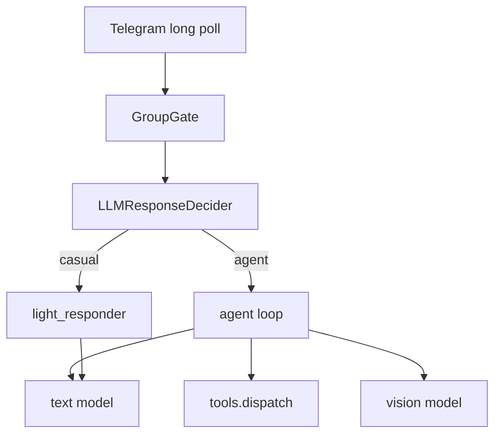

# Мистер Батон

Публичный Telegram-бот с характером: болтает в личке и группах, ищет в интернете, смотрит картинки, работает с файлами и ставит напоминания.

**Открыть бота:** [t.me/misterbatonbot](https://t.me/misterbatonbot)  
Можно писать сразу или добавить в группу как обычного бота.

---

## Что это

Не корпоративный ассистент, а живой собеседник с tool-агентом под капотом:

- диалог с памятью по чату  
- веб-поиск  
- vision (фото)  
- файлы PDF / DOCX / XLSX / …  
- блокнот и напоминания  

Код открыт — можно поднять своего бота за пару минут.

---

## Примеры

Вставь сюда свои скрины (пути уже готовы):

| | |
|---|---|
| Диалог |  |
| Поиск / ответ по фактам |  |
| Картинка |  |
| В группе |  |

Положи файлы в `docs/examples/` с этими именами — превью появятся сами.

---

## Быстрый запуск своего бота

Нужны: Python 3.10+, токен от [@BotFather](https://t.me/BotFather), ключ текста (например [Z.ai](https://z.ai)), опционально vision (например [OpenRouter](https://openrouter.ai/keys)).

```bash
git clone https://github.com/olezhapelmeshka/botmrbaton.git
cd botmrbaton
python3 -m venv .venv
source .venv/bin/activate          # Windows: .venv\Scripts\activate
pip install -r requirements.txt
```

Ключи через терминал (интерактивно):

```bash
bash scripts/setup_env.sh
```

Или одной пачкой (подставь свои значения):

```bash
cp .env.example .env
cat >> .env <<'EOF'
TELEGRAM_BOT_TOKEN=123456:ABC...
OWNER_USER_ID=123456789
OPENAI_API_KEY=...
OPENAI_BASE_URL=https://api.z.ai/api/paas/v4
OPENAI_MODEL=glm-4.5-flash
OPENAI_VISION_API_KEY=...
OPENAI_VISION_BASE_URL=https://openrouter.ai/api/v1
OPENAI_VISION_MODEL=gemini-2.5-flash
EOF
```

Запуск:

```bash
python bot/main.py
```

Постоянно на macOS (автостарт + рестарт при падении):

```bash
bash scripts/install_launchagent.sh
```

> Публичный инстанс [@misterbatonbot](https://t.me/misterbatonbot) уже крутится. Скрипт выше — для своей копии.

---

<details>
<summary>Для разработчиков (EN / архитектура)</summary>

**EN:** Telegram character-agent with tool use, dual-path group intelligence, OpenAI-compatible multi-model routing (text + vision). MIT.



```bash
pytest -q
```

См. также [docs/architecture.md](docs/architecture.md).

</details>
