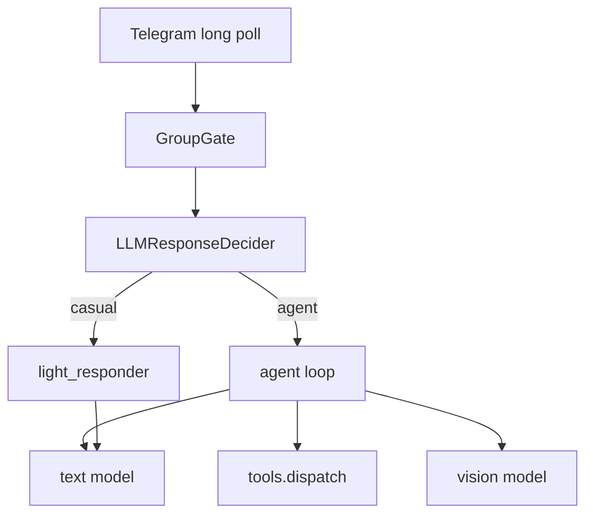

# Мистер Батон

Публичный Telegram-бот с характером: болтает в личке и группах, ищет в интернете, смотрит картинки, работает с файлами и ставит напоминания.

**Открыть бота:** [t.me/misterbatonbot](https://t.me/misterbatonbot)  
Можно писать сразу или добавить в группу как обычного бота.

---

## Что это

Не корпоративный ассистент, а живой собеседник с tool-агентом под капотом:

- диалог с памятью по чату  
- веб-поиск  
- vision (фото)  
- файлы PDF / DOCX / XLSX / …  
- блокнот и напоминания  

Код открыт — можно поднять своего бота за пару минут.

---

## Примеры

Вставь сюда свои скрины (пути уже готовы):

| | |
|---|---|
| Диалог |  |
| Поиск / ответ по фактам |  |
| Картинка |  |
| В группе |  |

Положи файлы в `docs/examples/` с этими именами — превью появятся сами.

---

## Быстрый запуск своего бота

Нужны: Python 3.10+, токен Telegram, **ключ текста (Z.ai)** и **ключ vision (OpenRouter)**.

### 1) Telegram

1. [@BotFather](https://t.me/BotFather) → `/newbot` (или `/token`) → скопируй токен → это `TELEGRAM_BOT_TOKEN`
2. [@userinfobot](https://t.me/userinfobot) → свой числовой id → это `OWNER_USER_ID`

### 2) Текст — Z.ai (`glm-4.5-flash`)

Это основной чат-движок бота (дешёвый/бесплатный GLM).

1. Открой [z.ai/model-api](https://z.ai/model-api) → зарегистрируйся / войди  
2. Ключ: [z.ai/manage-apikey/apikey-list](https://z.ai/manage-apikey/apikey-list) → **Create API Key** → копируй → это `OPENAI_API_KEY`  
3. Модель: в `.env` пиши ровно `OPENAI_MODEL=glm-4.5-flash`  
   (карточка модели: [docs.z.ai — GLM-4.5](https://docs.z.ai/guides/llm/glm-4.5))  
4. Base URL (не меняй): `OPENAI_BASE_URL=https://api.z.ai/api/paas/v4`

Документация OpenAI-совместимого SDK: [docs.z.ai](https://docs.z.ai/guides/develop/openai/python).

### 3) Картинки — OpenRouter (`google/gemini-2.5-flash`)

Отдельный ключ только для vision (фото). Текст по-прежнему идёт в Z.ai.

1. Открой [openrouter.ai](https://openrouter.ai) → Sign In  
2. Ключ: [openrouter.ai/keys](https://openrouter.ai/keys) → **Create API Key** → копируй → это `OPENAI_VISION_API_KEY`  
3. Модель: страница [google/gemini-2.5-flash](https://openrouter.ai/google/gemini-2.5-flash) → в `.env` пиши ровно  
   `OPENAI_VISION_MODEL=google/gemini-2.5-flash`  
4. Base URL (не меняй): `OPENAI_VISION_BASE_URL=https://openrouter.ai/api/v1`

### 4) Установка и `.env`

```bash
git clone https://github.com/olezhapelmeshka/botmrbaton.git
cd botmrbaton
python3 -m venv .venv
source .venv/bin/activate          # Windows: .venv\Scripts\activate
pip install -r requirements.txt
```

Ключи через терминал (интерактивно):

```bash
bash scripts/setup_env.sh
```

Или одной пачкой (подставь свои значения):

```bash
cp .env.example .env
cat > .env <<'EOF'
TELEGRAM_BOT_TOKEN=123456:ABC...
OWNER_USER_ID=123456789

# текст = Z.ai API Key + glm-4.5-flash
OPENAI_API_KEY=вставь_ключ_с_z.ai_manage-apikey
OPENAI_BASE_URL=https://api.z.ai/api/paas/v4
OPENAI_MODEL=glm-4.5-flash

# картинки = OpenRouter API Key + google/gemini-2.5-flash
OPENAI_VISION_API_KEY=вставь_ключ_с_openrouter.ai_keys
OPENAI_VISION_BASE_URL=https://openrouter.ai/api/v1
OPENAI_VISION_MODEL=google/gemini-2.5-flash
EOF
```

Запуск:

```bash
python bot/main.py
```

Постоянно на macOS (автостарт + рестарт при падении):

```bash
bash scripts/install_launchagent.sh
```

> Публичный инстанс [@misterbatonbot](https://t.me/misterbatonbot) уже крутится. Скрипт выше — для своей копии.

---

<details>
<summary>Для разработчиков (EN / архитектура)</summary>

**EN:** Telegram character-agent with tool use, dual-path group intelligence, OpenAI-compatible multi-model routing (text + vision). MIT.



```bash
pytest -q
```

См. также [docs/architecture.md](docs/architecture.md).

</details>
