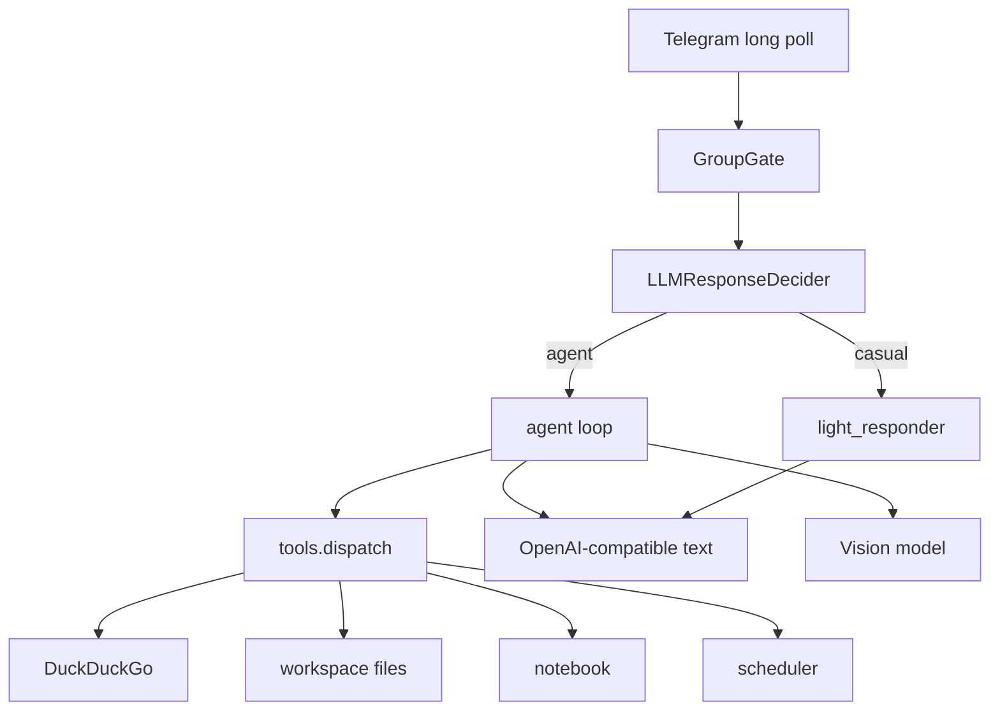

# Mr. Baton — Telegram character-agent

**EN:** Telegram character-agent with tool use, dual-path group intelligence (cheap gate → casual vs full agent), and OpenAI-compatible multi-model routing (text + vision).

**RU:** Telegram-бот с характером для живых групповых чатов: агент с инструментами, умный group-gate и раздельные модели для текста и картинок.

License: [MIT](LICENSE)

---

## AI highlights (portfolio)

- **Tool-using agent loop** — web search, files (PDF/Office), notebook, reminders, YouTube analysis
- **Dual-path group intelligence** — gate + LLM “should I reply?” → light `casual` path or full `agent` path
- **Multi-provider routing** — GLM (or any OpenAI-compatible) for text; optional separate vision endpoint (e.g. Gemini)
- **Context hygiene** — GLM 8K-aware trimming, vision placeholders in memory, anti-repeat character prompts



---

## Features

| Feature | How it works |
|---------|----------------|
| Chat | OpenAI-compatible LLM, history per `chat_id` |
| Web search | DuckDuckGo HTML scrape (no API key) |
| Vision | Separate vision endpoint for photos |
| Files | Read/create PDF, DOCX, XLSX, TXT, MD, CSV, JSON, PPTX |
| Notebook | Per-user JSON notes |
| Reminders | once / daily / weekly / interval + natural-language parser |

---

## Quick start

```bash
python -m venv .venv
source .venv/bin/activate   # Windows: .venv\Scripts\activate
pip install -r requirements.txt
cp .env.example .env
```

Fill `.env` (recommended free stack: GLM text + Gemini vision):

```ini
TELEGRAM_BOT_TOKEN=123456:ABC...
OWNER_USER_ID=123456789
OPENAI_API_KEY=...
OPENAI_BASE_URL=https://api.z.ai/api/paas/v4
OPENAI_MODEL=glm-4.5-flash
OPENAI_VISION_API_KEY=...
OPENAI_VISION_BASE_URL=https://openrouter.ai/api/v1
OPENAI_VISION_MODEL=gemini-2.5-flash
```

Run:

```bash
python bot/main.py
```

Tests:

```bash
pytest -q
```

---

## Bot commands

| Command | Action |
|---------|--------|
| `/start` | Greeting |
| `/help` | Help |
| `/reset` | Clear dialog history |
| `/files` | List workspace files |
| `/clear` | Delete files + history |
| `/model` | Pick fast / smart / default / auto |
| `/schedule_add HH:MM text` | Add reminder |
| `/schedule_list` | List reminders |
| `/schedule_remove N` | Remove reminder |

---

## Project structure

```
bot/
├── main.py              # Long poll, commands, media, routing
├── agent.py             # Agent loop (tools, vision, memory)
├── light_responder.py   # Casual path (no tools)
├── openai_client.py     # OpenAI-compatible client + response adapter
├── tools.py             # Tool schemas + dispatch()
├── prompts.py           # System prompts (private / group / casual)
├── config.py            # .env loading + validate()
├── telegram_api.py      # Telegram HTTP wrappers
├── memory.py            # Dialog history
├── chat_history.py      # Per-chat history helpers
├── workspace.py / files.py
├── schedules.py / scheduler.py / reminder_parser.py
├── notebook.py
├── web_search.py
├── group/               # Group gate subsystem
│   ├── gate.py          # Main gate decision
│   ├── decision.py      # LLM “should respond?” + path
│   ├── access.py        # Owner / VIP / trusted levels
│   ├── config.py        # Per-group presets
│   ├── rate_limiter.py / spam.py / context.py / types.py
│   └── examples.py
└── ...
data/                    # Runtime only (gitignored; .gitkeep kept)
tests/                   # pytest
docs/                    # Extra notes (optional)
```

---

## Config notes

- Secrets only in `.env` (see [`.env.example`](.env.example))
- Set `OWNER_USER_ID` (and optional `VIP_USER_ID`) so privileged users bypass group rate limits
- Free OpenRouter `:free` models are capped by **requests/day**, not tokens — for a chatty group bot prefer a high-volume free GLM endpoint as default; use large free models (e.g. Nemotron) only as optional “smart” routing after understanding [OpenRouter free limits](https://openrouter.ai/docs/api_reference/limits)

---

## Security

- API keys never committed (`.env` gitignored)
- Image bytes stay in the current vision request; memory stores placeholders
- `data/`, `logs/`, `tmp/` are ignored

---

## Demo

Self-host with the steps above, then in Telegram:

1. `/start` in private chat  
2. Ask for weather / a file / a reminder  
3. Add the bot to a group, set `GROUP_PROACTIVE_MODE=true` if you want the LLM gate  

Screenshots/GIFs welcome in PRs under `docs/`.
