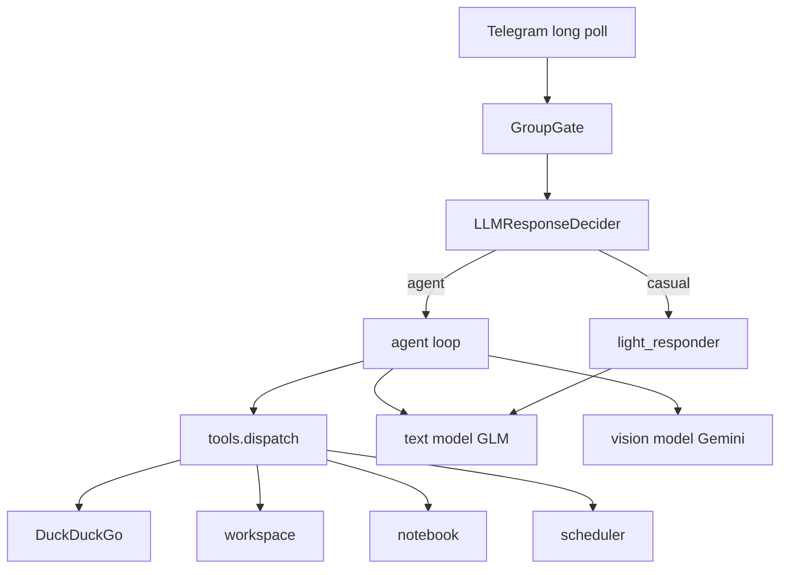

# Мистер Батон

**Бесплатный** способ сделать себе Telegram-ассистента с характером: без подписки на ChatGPT, без своего GPU — только открытый код + бесплатные/дешёвые API (GLM на Z.ai, vision через OpenRouter).

Болтает в личке и группах, ищет в интернете, смотрит картинки, работает с файлами и ставит напоминания.

**Открыть бота:** [t.me/misterbatonbot](https://t.me/misterbatonbot)  
Можно писать сразу или добавить в группу как обычного бота. Свой инстанс поднимается за пару минут по инструкции ниже.

---

## Что это

Не корпоративный ассистент, а живой собеседник с tool-агентом под капотом:

- диалог с памятью по чату  
- веб-поиск  
- vision (фото)  
- файлы PDF / DOCX / XLSX / …  
- блокнот и напоминания  

Весь стек рассчитан на **$0** (или почти $0): текст — `glm-4.5-flash` на Z.ai, картинки — `google/gemini-2.5-flash` на OpenRouter. Код открыт (MIT).

---

## Примеры

Живой бот: [t.me/misterbatonbot](https://t.me/misterbatonbot) — напиши в личку или добавь в группу.

Скрины диалога / поиска / vision / группы можно положить в `docs/examples/` (`01-chat.png` … `04-group.png`).

---

## Быстрый запуск своего бота

Нужны: Python 3.10+, токен Telegram, **ключ текста (Z.ai)** и **ключ vision (OpenRouter)**.

### 1) Telegram

1. [@BotFather](https://t.me/BotFather) → `/newbot` (или `/token`) → скопируй токен → это `TELEGRAM_BOT_TOKEN`
2. [@userinfobot](https://t.me/userinfobot) → свой числовой id → это `OWNER_USER_ID`

### 2) Текст — Z.ai (`glm-4.5-flash`)

Это основной чат-движок бота (дешёвый/бесплатный GLM).

1. Открой [z.ai/model-api](https://z.ai/model-api) → зарегистрируйся / войди  
2. Ключ: [z.ai/manage-apikey/apikey-list](https://z.ai/manage-apikey/apikey-list) → **Create API Key** → копируй → это `OPENAI_API_KEY`  
3. Модель: в `.env` пиши ровно `OPENAI_MODEL=glm-4.5-flash`  
   (карточка модели: [docs.z.ai — GLM-4.5](https://docs.z.ai/guides/llm/glm-4.5))  
4. Base URL (не меняй): `OPENAI_BASE_URL=https://api.z.ai/api/paas/v4`

Документация OpenAI-совместимого SDK: [docs.z.ai](https://docs.z.ai/guides/develop/openai/python).

### 3) Картинки — OpenRouter (`google/gemini-2.5-flash`)

Отдельный ключ только для vision (фото). Текст по-прежнему идёт в Z.ai.

1. Открой [openrouter.ai](https://openrouter.ai) → Sign In  
2. Ключ: [openrouter.ai/keys](https://openrouter.ai/keys) → **Create API Key** → копируй → это `OPENAI_VISION_API_KEY`  
3. Модель: страница [google/gemini-2.5-flash](https://openrouter.ai/google/gemini-2.5-flash) → в `.env` пиши ровно  
   `OPENAI_VISION_MODEL=google/gemini-2.5-flash`  
4. Base URL (не меняй): `OPENAI_VISION_BASE_URL=https://openrouter.ai/api/v1`

### 4) Установка и `.env`

```bash
git clone https://github.com/olezhapelmeshka/botmrbaton.git
cd botmrbaton
python3 -m venv .venv
source .venv/bin/activate          # Windows: .venv\Scripts\activate
pip install -r requirements.txt
```

Ключи через терминал (интерактивно):

```bash
bash scripts/setup_env.sh
```

Или одной пачкой (подставь свои значения):

```bash
cp .env.example .env
cat > .env <<'EOF'
TELEGRAM_BOT_TOKEN=123456:ABC...
OWNER_USER_ID=123456789

# текст = Z.ai API Key + glm-4.5-flash
OPENAI_API_KEY=вставь_ключ_с_z.ai_manage-apikey
OPENAI_BASE_URL=https://api.z.ai/api/paas/v4
OPENAI_MODEL=glm-4.5-flash

# картинки = OpenRouter API Key + google/gemini-2.5-flash
OPENAI_VISION_API_KEY=вставь_ключ_с_openrouter.ai_keys
OPENAI_VISION_BASE_URL=https://openrouter.ai/api/v1
OPENAI_VISION_MODEL=google/gemini-2.5-flash
EOF
```

Запуск:

```bash
python bot/main.py
```

Постоянно на macOS (автостарт + рестарт при падении):

```bash
bash scripts/install_launchagent.sh
```

> Публичный инстанс [@misterbatonbot](https://t.me/misterbatonbot) уже крутится. Скрипт выше — для своей копии.

---

## Краткая история проекта

- **Июнь 2026** — первая рабочая версия: личный Telegram-бот с характером, памятью, инструментами и групповым gate; пре-релиз на GitHub.  
- **Июль 2026** — публичный релиз для портфолио: обезличенные промпты, MIT, тесты/CI, анти-зацикливание на мемах, README с пошаговым бесплатным стеком (Z.ai + OpenRouter), живой [@misterbatonbot](https://t.me/misterbatonbot).

Идея с самого начала: показать, что нормальный AI-ассистент в Telegram можно собрать **бесплатно** на открытых моделях, без корпоративного «helpdesk»-тона.

---

# Mr. Baton (English)

A **free** way to run your own Telegram AI assistant: open-source code + free/cheap OpenAI-compatible APIs (GLM on Z.ai for text, Gemini on OpenRouter for vision). No ChatGPT subscription, no GPU required.

**Try it live:** [t.me/misterbatonbot](https://t.me/misterbatonbot)  
**License:** MIT

## What it is

Not a corporate helpdesk bot — a character-first chat agent with real tooling:

| Capability | Details |
|------------|---------|
| Chat + memory | Per-chat history, anti-repeat hygiene |
| Web search | DuckDuckGo HTML (no extra API key) |
| Vision | Separate multimodal endpoint for photos |
| Files | Read/create PDF, DOCX, XLSX, TXT, MD, CSV, JSON, PPTX |
| Notebook & reminders | Per-chat notes; once / daily / weekly / interval |
| Group intelligence | Gate → LLM “should I reply?” → `casual` or full `agent` path |

## Free stack (recommended)

| Role | Provider | Where to get the key | Model ID | Base URL |
|------|----------|----------------------|----------|----------|
| Text | [Z.ai](https://z.ai/model-api) | [API Keys](https://z.ai/manage-apikey/apikey-list) | `glm-4.5-flash` | `https://api.z.ai/api/paas/v4` |
| Vision | [OpenRouter](https://openrouter.ai) | [Keys](https://openrouter.ai/keys) | `google/gemini-2.5-flash` | `https://openrouter.ai/api/v1` |
| Bot token | Telegram | [@BotFather](https://t.me/BotFather) | — | — |

Free tiers still have rate limits — that is expected. For a personal or small-group assistant this stack is enough to run at **$0**.

## Architecture



More detail: [docs/architecture.md](docs/architecture.md).

## Quick start

```bash
git clone https://github.com/olezhapelmeshka/botmrbaton.git
cd botmrbaton
python3 -m venv .venv && source .venv/bin/activate
pip install -r requirements.txt
bash scripts/setup_env.sh    # or copy .env.example → .env and fill keys
python bot/main.py
```

macOS always-on (login + crash restart):

```bash
bash scripts/install_launchagent.sh
```

Tests:

```bash
pytest -q
```

## Project history

- **June 2026** — first working personal bot (character prompts, tools, group gate); pre-release on GitHub.  
- **July 2026** — public portfolio release: depersonalized prompts, MIT, CI/tests, anti-meme looping, free-stack docs, live [@misterbatonbot](https://t.me/misterbatonbot).
