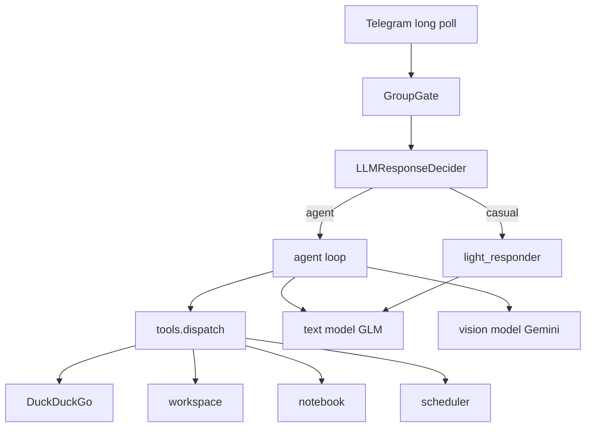

# Architecture

Internal design notes for Mr. Baton. For setup and “what is this bot”, see the [README](../README.md).

## High-level flow



1. `bot/main.py` receives an update (text / photo / document / command).
2. For groups, `GroupGate` decides whether to process the message (owner/VIP bypass, rate limits, spam, mentions, triggers).
3. If proactive mode is on, `LLMResponseDecider` returns YES/NO plus a suggested path: `casual` or `agent`.
4. **Casual** → `light_responder` (short character reply, no tools).
5. **Agent** → `agent.handle_message` tool loop (max iterations) via `openai_client` + `tools.dispatch`.
6. Persistence: memory, workspace files, notebook, schedules.

## Why dual path

Full tool prompts on every group joke waste tokens and often produce empty/awkward replies on small free models. The gate keeps the bot lively without waking the agent for every message.

## Models

| Role | Env vars | Recommended free stack |
|------|----------|------------------------|
| Text | `OPENAI_API_KEY`, `OPENAI_BASE_URL`, `OPENAI_MODEL` | Z.ai `glm-4.5-flash`, base `https://api.z.ai/api/paas/v4` |
| Vision | `OPENAI_VISION_API_KEY`, `OPENAI_VISION_BASE_URL`, `OPENAI_VISION_MODEL` | OpenRouter `google/gemini-2.5-flash`, base `https://openrouter.ai/api/v1` |

Any OpenAI-compatible endpoint works. Vision is optional but recommended so the text model can stay cheap/free.

Free tiers still have **rate limits** (RPM/RPD). That is expected; for a personal or small-group bot the recommended stack is enough at ~$0.

## OWNER_USER_ID / VIP_USER_ID

- `OWNER_USER_ID` — your Telegram numeric user id (`@userinfobot`). In groups this user bypasses most rate/spam gates and gets debug logging.
- `VIP_USER_ID` — optional second privileged user (same idea).
- Private chats answer everyone; these IDs only matter for group privileges.

## Anti-meme looping

Group context prefers **user-only** recent history; `summary` does not store bot jokes. A simple token-overlap filter can silence near-duplicate bot replies (`[молчу]`). See `bot/memory.py`, `bot/utils.py`, group postprocess in `bot/main.py`.

## Layout

```
bot/
├── main.py              # long poll, commands, routing
├── agent.py             # tool loop, vision, memory
├── light_responder.py   # casual path (no tools)
├── openai_client.py     # OpenAI-compatible client + adapters
├── tools.py             # schemas + dispatch
├── prompts.py           # system prompts
├── config.py            # .env
├── group/               # gate, decision, rate limit, spam
└── ...
data/                    # runtime only (gitignored; .gitkeep kept)
tests/                   # pytest
scripts/                 # setup_env.sh, install_launchagent.sh
```

## Tests / CI

```bash
pytest -q
```

GitHub Actions runs the same smoke tests on push to `main`.
